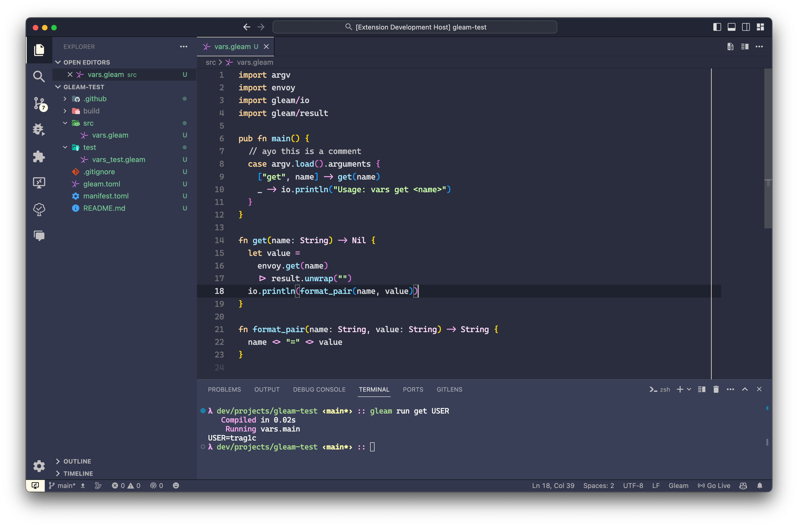
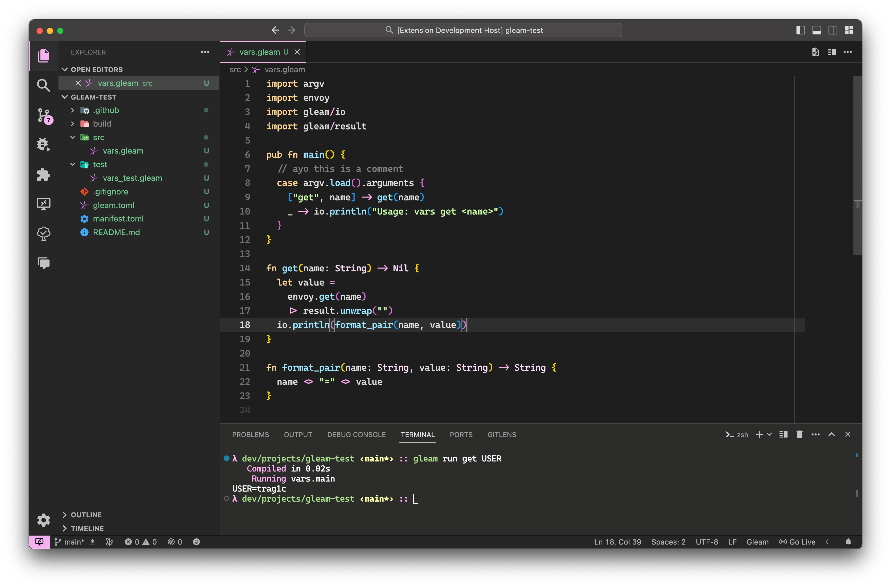
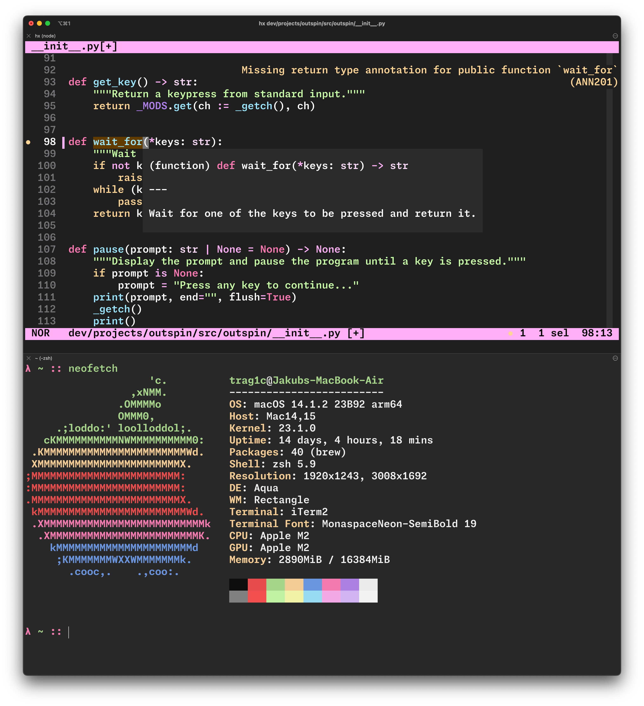
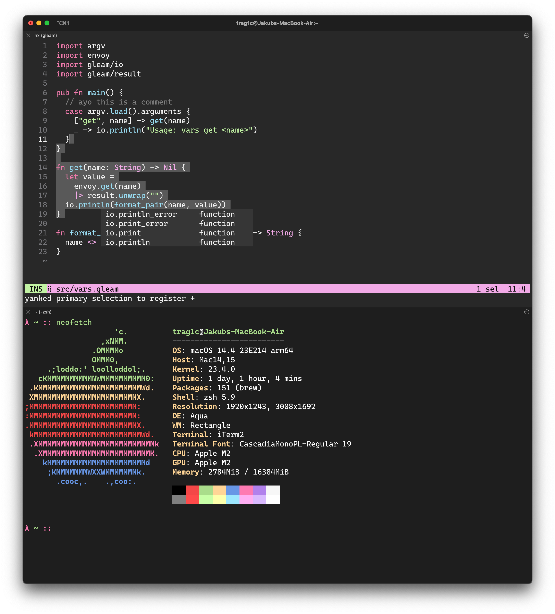

# Gleam theme

- [helix](#helix)
- [iTerm](#iterm)
- [Visual Studio Code](#visual-studio-code)


helix/iTerm/VSCode color themes based on the one found on [Gleam's website][gleam-website].

Shoutout to [@aslilac][aslilac] and
[@lpil][lpil] for the original design! ❤️

My part of the job was implementing the original colors, adding some missing
ones and designing the rest of the editor :)




*The above screenshots also use [Material Icon Theme][material-icon-theme] and*
*[Material Product Icons][material-product-icons].*



<br>

# Installing

## helix

Download the `helix.zip` file and unzip it into the `themes` folder in your config directory
(most likely `~/.config/helix/themes/`).

Try it out through the `:theme gleam` command or set it permanently in your helix config
(most likely `~/.config/helix/config.toml`):
```toml
theme = "gleam"
```

## iTerm

Download the `iterm.zip` file from [Releases],
unzip it and import the themes via `Profiles > Colors > Color Presets... > Import...`.

## Visual Studio Code

Download the extension from the [VSCode Marketplace][vscode-marketplace] or the [Open VSX Registry][open-vsx-registry].

*or*

Download the `.vsix` file (found in [Releases]) and use
[`Extensions: Install from VSIX...`][vscode-install-from-vsix].

*or*

Clone this repository and use
[`Developer: Install Extension from Location...`][vscode-install-from-location].

[gleam-website]: https://gleam.run/
[aslilac]: https://github.com/aslilac/
[lpil]: https://github.com/lpil/
[material-icon-theme]: https://marketplace.visualstudio.com/items?itemName=PKief.material-icon-theme/
[material-product-icons]: https://marketplace.visualstudio.com/items?itemName=PKief.material-product-icons/
[Releases]: https://github.com/trag1c/gleam-theme/releases/
[vscode-marketplace]: https://marketplace.visualstudio.com/items?itemName=trag1c.gleam-theme/
[open-vsx-registry]: https://open-vsx.org/extension/trag1c/gleam-theme/
[vscode-install-from-vsix]: https://code.visualstudio.com/docs/editor/extension-marketplace#_install-from-a-vsix/
[vscode-install-from-location]: https://code.visualstudio.com/updates/v1_74#_install-an-extension-located-on-disk/