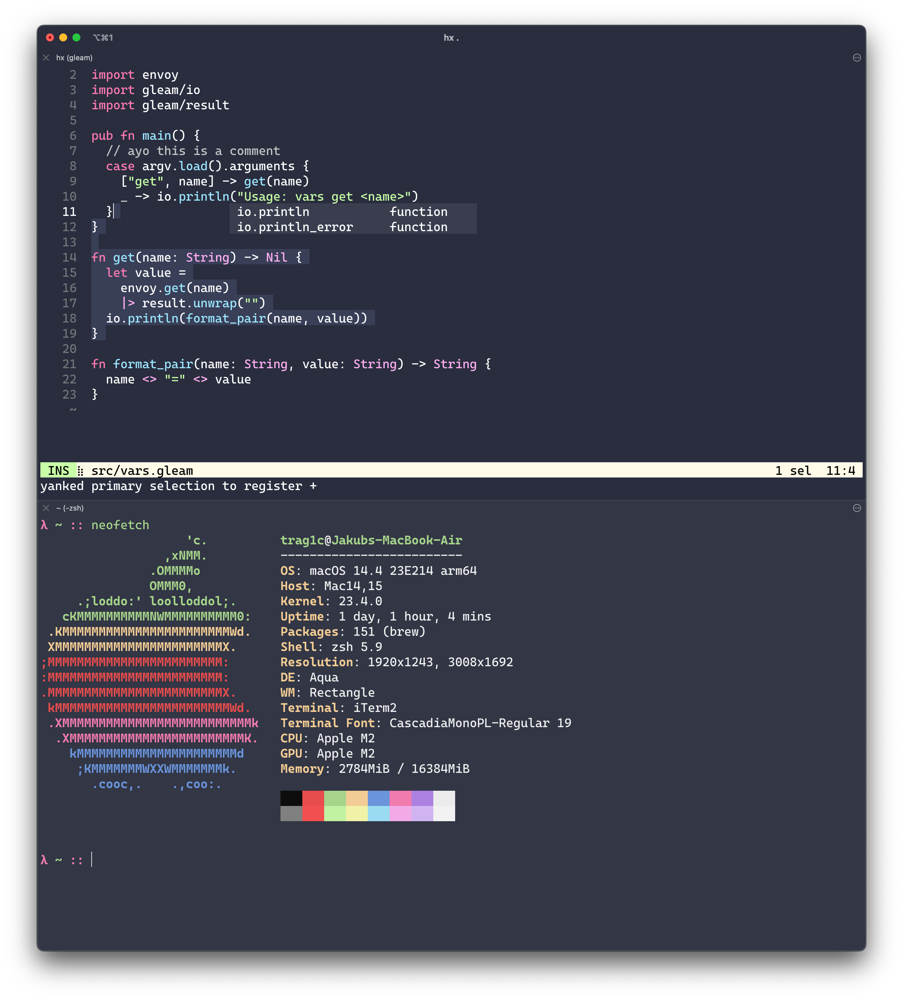

# Gleam Theme

A helix/iTerm/VSCode color theme based on the one found on [Gleam's website](https://gleam.run). 

Shoutout to [@aslilac](https://github.com/aslilac) and
[@lpil](https://github.com/lpil) for the original design! ❤️

My part of the job was implementing the original colors, adding some missing
ones and designing the rest of the editor :)


*The above screenshot also uses [Material Icon Theme](https://marketplace.visualstudio.com/items?itemName=PKief.material-icon-theme) and [Material Product Icons](https://marketplace.visualstudio.com/items?itemName=PKief.material-product-icons).*


<br>

# Installing

## helix

Download the `gleam-theme.toml` file and put it in the `themes` folder in your config directory (most likely `~/.config/helix/themes/`).

Try it out through the `:theme gleam-theme` command or set it permanently in your helix config (most likely `~/.config/helix/config.toml`):
```toml
theme = "gleam-theme"
```

## iTerm

Download the `Gleam Theme.itermcolors` file and import it via `Profiles > Colors > Color Presets... > Import...`.

## Visual Studio Code

Download the extension from the [VSCode Marketplace](https://marketplace.visualstudio.com/items?itemName=trag1c.gleam-theme) or the [Open VSX Registry](https://open-vsx.org/extension/trag1c/gleam-theme).

*or*

Download the `.vsix` file (found in [Releases](https://github.com/trag1c/gleam-theme/releases)) and use
[`Extensions: Install from VSIX...`](https://code.visualstudio.com/docs/editor/extension-marketplace#_install-from-a-vsix).

*or*

Clone this repository and use
[`Developer: Install Extension from Location...`](https://code.visualstudio.com/updates/v1_74#_install-an-extension-located-on-disk).